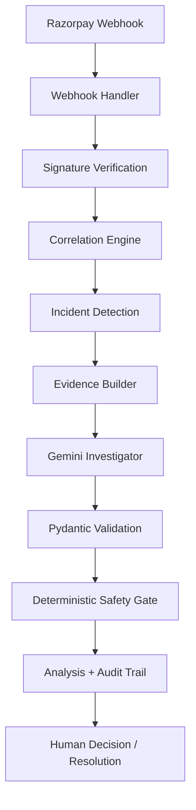

# PayTrace: Incident Intelligence & Reconciliation

PayTrace is a payment incident intelligence and reconciliation system built around Razorpay-style payment webhooks. It is designed to deterministically detect state mismatches between a payment gateway and a merchant system, gather evidence, and use an AI as an **advisor** (never an executor) to recommend the next step for human operators.

---

## The Problem

Payment gateways and merchant systems can temporarily disagree about a payment's state due to dropped webhooks, network failures, or race conditions. A payment may be captured by the gateway while the merchant order remains pending, creating reconciliation risk, operational uncertainty, and potential financial loss or poor customer experience.

## The Solution

PayTrace solves this by treating payment anomalies as **Incidents**. 
Instead of trusting the AI to perform high-stakes financial operations, PayTrace uses deterministic logic to identify facts, bounds the AI with a strict safety layer, and focuses the LLM purely on root-cause investigation and human-readable summarization.

### Why AI?
AI is used for investigation and explanation, not payment execution. Deterministic code establishes the facts and safety boundaries, while Gemini helps summarize evidence, identify plausible causes, and recommend the next investigation step.

### Why NOT an AI Agent?
PayTrace intentionally does NOT allow an autonomous agent to refund, capture, transfer, or cancel payments. These actions have direct financial consequences and require deterministic guardrails and human oversight.

---

## Architecture



## Core Workflow

1. **Webhook Ingestion**: Razorpay webhooks are received and cryptographically verified.
2. **Idempotency Check**: Duplicate webhooks are ignored securely.
3. **Incident Detection**: PayTrace correlates the webhook with the internal merchant database. If a mismatch is detected (e.g., Gateway is CAPTURED, Merchant is PENDING), an Incident is created.
4. **Evidence Generation**: A sanitized, deterministic evidence package is built.
5. **AI Investigation**: Gemini analyzes the evidence to infer the likely cause and recommend an action.
6. **Deterministic Safety Gate**: The system overrides the AI if it attempts a financially sensitive action, mapping it to strict safety boundaries.
7. **Human Resolution**: Operators review the audit trail, take action, and resolve the incident.

---

## Features & Resilience

### Deterministic Safety Gate
The AI's recommendations are strictly gated:
- `INVESTIGATE` → **INFORMATIONAL**
- `RECONCILE` / `CANCEL` → **REQUIRES_HUMAN_APPROVAL**
- `REFUND` / `CAPTURE` / `TRANSFER` / `UNKNOWN` → **BLOCKED**

### Failure Handling
| Failure | Behavior |
| :--- | :--- |
| **Invalid Webhook Signature** | Safely rejected (HTTP 400). |
| **Duplicate Webhook** | Idempotently ignored. State remains uncorrupted. |
| **Missing Incident** | Standard HTTP 404 response. |
| **Gemini Unavailable / Timeout** | Graceful application failure. No fake analysis is created. |
| **Gemini Malformed Output** | Rejected deterministically. No corrupt data persisted. |
| **Unsafe AI Action** | Deterministically blocked by the safety gate. |
| **Database Exception** | Transaction rollback. No partial states. |

### Audit Trail
Every major lifecycle event (Creation, AI Analysis, Resolution) is appended to an immutable audit trail, providing full observability into *what* happened and *why*.

### Security Principles
- **Data Minimization**: Only essential metadata is parsed and stored.
- **Secret Isolation**: Credentials (API Keys, Webhook Secrets) are strictly environment variables.
- **Fail-Safe**: If any internal service fails, it fails closed, refusing to act on partial information.

---

## Setup & Execution

### Prerequisites
- Python 3.10+
- Razorpay Account (Test Mode)
- Google Gemini API Key

### Environment Variables
Copy `.env.example` to `.env`:
```bash
cp .env.example .env
```
Populate `.env` with your credentials:
```
RAZORPAY_KEY_ID=your_razorpay_key_id
RAZORPAY_KEY_SECRET=your_razorpay_secret
RAZORPAY_WEBHOOK_SECRET=your_webhook_secret
AI_API_KEY=your_gemini_api_key
AI_MODEL=gemini-1.5-flash
```

### Running Locally
1. Create and activate a virtual environment:
   ```bash
   python -m venv venv
   source venv/bin/activate  # On Windows: venv\Scripts\activate
   ```
2. Install dependencies:
   ```bash
   pip install -r requirements.txt
   ```
3. Start the server:
   ```bash
   fastapi dev app/main.py
   ```
The API documentation will be available at `http://127.0.0.1:8000/docs`.

### Running Tests
Run the complete test suite (includes End-to-End integration tests):
```bash
python -m pytest
```

---

## Demo Walkthrough

To experience the system end-to-end:

1. **Start the server**.
2. **Trigger Demo Mismatch**: Send a `POST` to `/api/demo/trigger-mismatch`. This simulates a Razorpay webhook for an order that the merchant thinks is still pending.
3. **List Incidents**: Send a `GET` to `/api/incidents`. Notice the new incident created.
4. **Generate Analysis**: Send a `POST` to `/api/incidents/{incident_id}/analysis`. Wait for the AI to investigate.
5. **Review Analysis**: Inspect the response. Notice the `action_safety` field enforced by the deterministic gate.
6. **Resolve Incident**: Send a `POST` to `/api/incidents/{incident_id}/resolve` to close the incident and append to the audit trail.

---

## Design Tradeoffs & Future Improvements

- **Database**: SQLite is used for simplicity and portability in this prototype. In a real-world scenario, PostgreSQL would be used to handle high concurrency.
- **Event Bus**: The current architecture is synchronous. A production system would likely decouple webhook ingestion from processing using a message queue (e.g., Kafka or SQS) for maximum ingestion availability.
- **Retries**: Gemini API retries are intentionally excluded from this prototype to favor predictable, immediate failure states over silent latency. A production environment would use exponential backoff for 429/50x errors.
